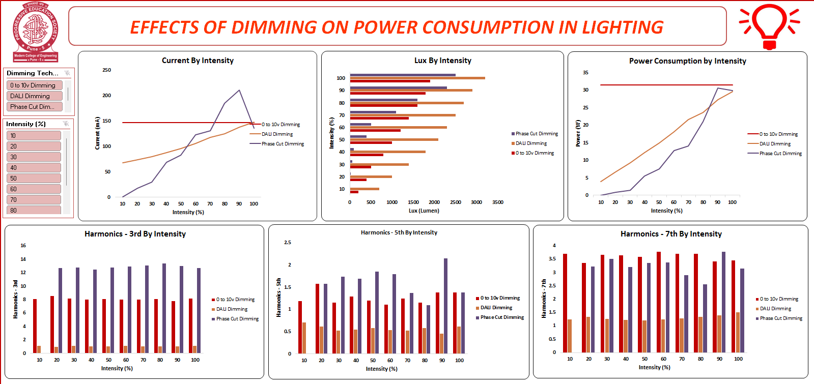

# Comparative Analysis of Lighting Dimming Techniques

## Project Overview

This project was developed as part of my **Final Year Engineering Project**.

The objective of this project is to analyze and compare different lighting dimming techniques and evaluate their impact on:

* Power Consumption
* Current
* Light Output (Lux)
* Electrical Harmonics

The study compares three commonly used dimming technologies:

* 0–10V Dimming
* DALI Dimming
* Phase Cut Dimming

The results demonstrate that **DALI dimming provides better performance and efficiency compared to the other techniques**.

---

## Dashboard Preview



---

## Key Parameters Analyzed

The analysis includes the following electrical and lighting parameters:

* Intensity (%)
* Current (mA)
* Lux (Lumen)
* Power Consumption (W)
* 3rd Harmonic
* 5th Harmonic
* 7th Harmonic

---

## Project Objective

The main goal of this project is to determine which dimming technique provides:

* Better energy efficiency
* Stable electrical performance
* Lower harmonic distortion
* Better lighting control

---

## Key Result

Based on the analysis, **DALI dimming technique provides better performance**, including:

* Stable current variation
* Efficient power usage
* Better lighting output
* Lower harmonic distortion compared to other techniques

---

## Tools Used

* Microsoft Excel
* Data Analysis
* Dashboard Visualization

---

## Project Structure

```
comparative-analysis-of-lighting-dimming-techniques
│
├── dashboard
│   └── Lighting_Dimming_Dashboard.png
│
├── dataset
│   └── lighting-dimming-performance-analysis.xlsx
│
└── README.md
```

---

## Author

Prajakta Kumbhar


